# Onlyboxes

[简体中文](README.zh-CN.md)

Onlyboxes is a self-hosted code execution sandbox platform for individuals and small teams.
It uses a control-plane (`console`) and execution-plane (`worker-docker`) architecture, and exposes both REST APIs and MCP tools.

> [!WARNING]
> In the current release, console gRPC does not provide built-in TLS/mTLS.
>
> `worker-docker` rejects insecure console endpoints by default; plaintext is allowed only when `WORKER_CONSOLE_INSECURE=true` is explicitly set.
>
> Put both console HTTP (`:8089`) and gRPC (`:50051`) endpoints behind your reverse proxy/gateway and enforce TLS for external traffic.

## Architecture



## Key Features

- Self-hosted control plane with web dashboard (embedded in `console`)
- Worker provisioning with one-time `WORKER_SECRET` delivery
- Account-based token management for execution APIs and MCP
- Capability-based execution (`echo`, `pythonExec`, `terminalExec`, `readImage`)
- Task lifecycle API for sync/async execution (`/api/v1/tasks`)
- SQLite persistence for accounts, tokens, workers, and tasks

## Quick Start (Self-Hosted)

### 1) Prerequisites

- Docker Engine (required by `worker-docker` runtime)
- Go `1.24+` (if you run worker from source)

### 2) Start the console service

1. Edit `docker/docker-compose.yml` and replace at least:
   - `CONSOLE_HASH_KEY`
   - `CONSOLE_DASHBOARD_PASSWORD`
2. Start console:

```bash
docker compose -f docker/docker-compose.yml up -d
```

View live logs:

```bash
docker compose -f docker/docker-compose.yml logs -f console
```

Console endpoints:

- Dashboard/API: `http://127.0.0.1:8089`

### 3) Sign in and create an access token

- Open `http://127.0.0.1:8089` in your browser.
- Sign in with the initialized admin account.

- Go to the token management page and create an access token.

- Save the plaintext token immediately (it is returned only once).

### 4) Create a worker identity in dashboard

- Go to Workers page and create a worker.

- Copy and securely store the startup command from the creation dialog (`WORKER_SECRET` is one-time visible).


### 5) Run `worker-docker`

- Download the latest worker binary from GitHub Releases:
  - `https://github.com/onlyboxes/onlyboxes/releases/latest`
- Use the startup command values from dashboard, and replace binary path with your downloaded executable.

```bash
# Example
WORKER_CONSOLE_INSECURE=true \
WORKER_CONSOLE_GRPC_TARGET=127.0.0.1:50051 \
WORKER_ID=<worker_id> \
WORKER_SECRET=<worker_secret> \
./onlyboxes-worker-docker
```

### 6) Verify readiness

- Confirm the worker is `online` on the dashboard Workers page.
- For REST/MCP request examples, use `API.md`.
- If no tokens are configured, `/mcp` and execution APIs return `401` by design.

## Production Checklist

- Replace all default credentials and rotate them regularly.
- Keep `:50051` private; expose only `:8089` through your trusted ingress/reverse proxy.
- Persist and back up the SQLite data directory (`CONSOLE_DB_PATH`).
- Run workers on isolated hosts and limit Docker daemon access to trusted operators only.
- Centralize logs and monitor worker online/offline events.

## Configuration Reference

### Console (`console`)

| Variable | Default | Notes |
| --- | --- | --- |
| `CONSOLE_HTTP_ADDR` | `:8089` | Dashboard + REST API listen address |
| `CONSOLE_GRPC_ADDR` | `:50051` | Worker registry gRPC listen address |
| `CONSOLE_HASH_KEY` | _(required)_ | HMAC key for hashing worker secrets and access tokens |
| `CONSOLE_DB_PATH` | `./db/onlyboxes-console.db` | SQLite database path |
| `CONSOLE_DB_BUSY_TIMEOUT_MS` | `5000` | SQLite busy timeout |
| `CONSOLE_TASK_RETENTION_DAYS` | `30` | Retention for completed task records |
| `CONSOLE_ENABLE_REGISTRATION` | `false` | Allow admin to register non-admin accounts |
| `CONSOLE_DASHBOARD_USERNAME` | _(empty)_ | Used only for first admin initialization |
| `CONSOLE_DASHBOARD_PASSWORD` | _(empty)_ | Used only for first admin initialization |

### Worker (`worker-docker`)

| Variable | Default | Notes |
| --- | --- | --- |
| `WORKER_ID` | _(required)_ | Issued by `POST /api/v1/workers` |
| `WORKER_SECRET` | _(required)_ | Issued once by `POST /api/v1/workers` |
| `WORKER_CONSOLE_GRPC_TARGET` | `127.0.0.1:50051` | Console gRPC target |
| `WORKER_CONSOLE_INSECURE` | `false` | `false` enforces TLS endpoint; set `true` only to allow plaintext console gRPC |
| `WORKER_HEARTBEAT_INTERVAL_SEC` | `5` | Worker heartbeat interval |
| `WORKER_HEARTBEAT_JITTER_PCT` | `20` | Heartbeat jitter percent |
| `WORKER_PYTHON_EXEC_DOCKER_IMAGE` | `python:slim` | Runtime image for `pythonExec` |
| `WORKER_TERMINAL_EXEC_DOCKER_IMAGE` | `coolfan1024/onlyboxes-default-worker:0.0.3` | Runtime image for `terminalExec` |
| `WORKER_TERMINAL_OUTPUT_LIMIT_BYTES` | `1048576` | Per-stream output limit |

## API Surfaces

- Dashboard auth: `/api/v1/console/*`
- Worker management (admin): `/api/v1/workers*`
- Command execution: `/api/v1/commands/echo`, `/api/v1/commands/terminal`
- Task execution: `/api/v1/tasks*`
- MCP (Streamable HTTP): `POST /mcp`

## Development

### Run backend from source

```bash
cd console
CONSOLE_HASH_KEY=$(openssl rand -hex 32) go run ./cmd/console
```

### Run web dev server

```bash
yarn --cwd web install
yarn --cwd web dev
```

Web dev URL defaults to `http://127.0.0.1:5178` and proxies `/api/*` to `http://127.0.0.1:8089`.

### Useful docs

- Unified API reference: `API.md`
- Console internals: `console/README/overview.md`
- Worker internals: `worker/worker-docker/README/overview.md`
- API/proto guide: `api/README/proto.md`
- Web app guide: `web/README.md`

## Release & Images

- GitHub workflow: `.github/workflows/package-release.yml`
- Console Docker image: `coolfan1024/onlyboxes:<version>` and `coolfan1024/onlyboxes:latest`
- Console binary includes embedded web assets

## Security and Operational Notes

- Console gRPC has no built-in TLS/mTLS in this release; `worker-docker` requires explicit `WORKER_CONSOLE_INSECURE=true` to connect over plaintext.
- Put console HTTP (`:8089`) and gRPC (`:50051`) behind a reverse proxy/gateway and enforce TLS on public/external links.
- `WORKER_SECRET` and access token plaintext values are returned only at creation time.
- `GET /api/v1/workers/:node_id/startup-command` and `GET /api/v1/console/tokens/:token_id/value` intentionally return `410 Gone`.
- Dashboard login sessions are in-memory and are invalidated when `console` restarts.

## License

[GNU AGPL v3.0](LICENSE)
