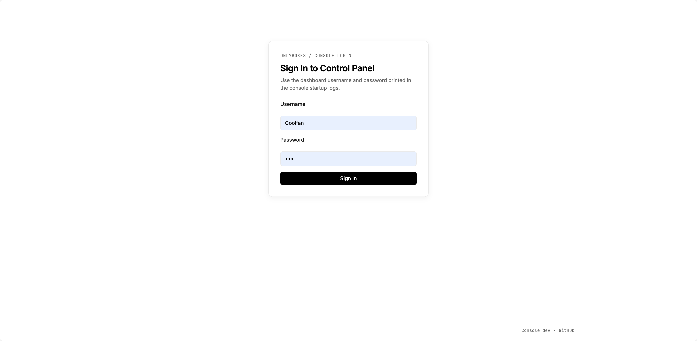
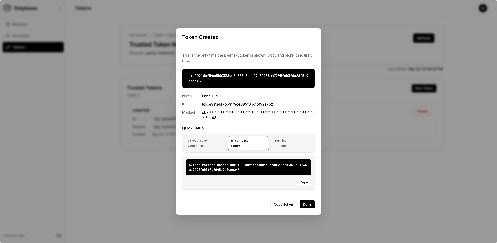
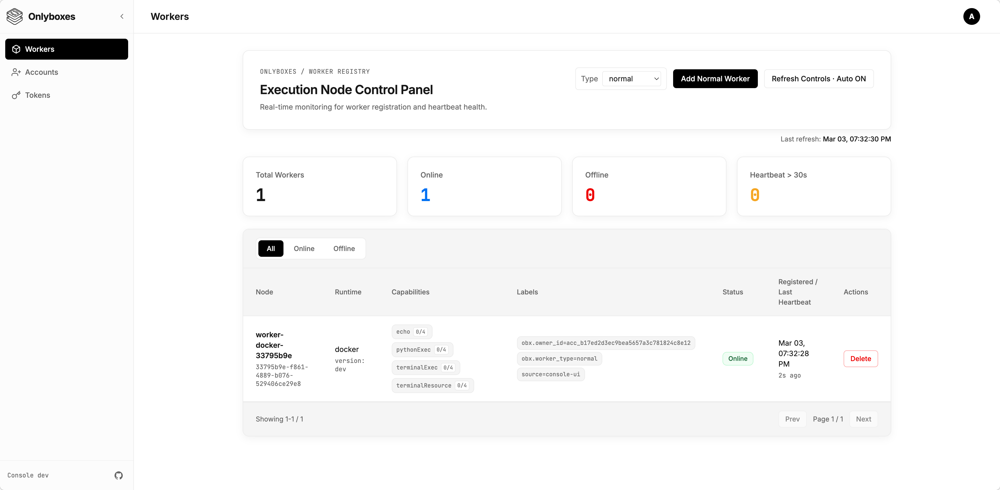
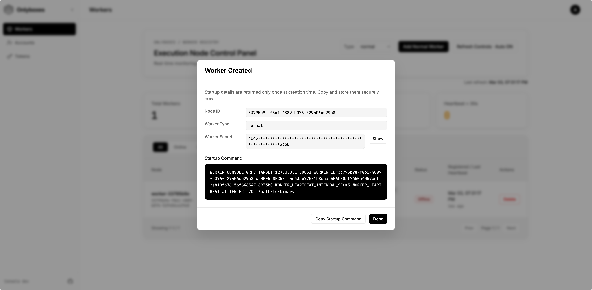

# Onlyboxes

[English](README.md)

Onlyboxes 是一个面向个人与小型团队的自托管代码执行沙箱平台。
系统采用控制面（`console`）与执行面（`worker-docker`）分离架构，并同时提供 REST API 与 MCP 接口。

> [!WARNING]
> 当前版本中，console gRPC 不提供内建 TLS/mTLS。
>
> `worker-docker` 默认会拒绝不安全的 console 端点；只有显式设置 `WORKER_CONSOLE_INSECURE=true` 才允许明文连接。
>
> 请将 console 的 HTTP（`:8089`）和 gRPC（`:50051`）端点放在反向代理/网关之后，并对外部流量强制开启 TLS。

## 架构



## 核心能力

- 自托管控制节点，内置 Web 控制台（由 `console` 提供）
- Worker 凭据按需创建，`WORKER_SECRET` 仅一次性下发
- 账号维度的 token 管理，用于执行 API 与 MCP 鉴权
- 能力路由执行（`echo`、`pythonExec`、`terminalExec`、`readImage`）
- 任务生命周期接口，支持同步/异步执行（`/api/v1/tasks`）
- SQLite 持久化账号、token、worker、task 元数据

## 快速开始（自托管）

### 1）前置条件

- Docker Engine（`worker-docker` 依赖）
- Go `1.24+`（若从源码运行 worker）

### 2）启动 console

1. 先修改 `docker/docker-compose.yml`，至少替换：
   - `CONSOLE_HASH_KEY`
   - `CONSOLE_DASHBOARD_PASSWORD`
2. 启动服务：

```bash
docker compose -f docker/docker-compose.yml up -d
```

查看实时日志：

```bash
docker compose -f docker/docker-compose.yml logs -f console
```

默认访问地址：

- 控制台/API：`http://127.0.0.1:8089`

### 3）登录并创建访问 token

- 浏览器打开 `http://127.0.0.1:8089`。
- 使用初始化的管理员账号登录。

- 进入 token 管理页面创建访问 token。

- token 明文只返回一次，请立即安全保存。

### 4）创建 worker 身份

- 在 Workers 页面创建 worker。

- 在创建弹窗中复制并安全保存启动命令（`WORKER_SECRET` 仅一次可见）。


### 5）启动 `worker-docker`

- 从 GitHub Releases 下载最新 worker 二进制：
  - `https://github.com/onlyboxes/onlyboxes/releases/latest`
- 将控制台中创建 worker 返回的参数替换到启动命令中，并将可执行文件路径替换为你下载的二进制。

```bash
# 示例
WORKER_CONSOLE_INSECURE=true \
WORKER_CONSOLE_GRPC_TARGET=127.0.0.1:50051 \
WORKER_ID=<worker_id> \
WORKER_SECRET=<worker_secret> \
./onlyboxes-worker-docker
```

### 6）验证运行状态

- 在控制台 Workers 页面确认 worker 状态为 `online`。
- REST/MCP 调用示例请参考 `API.zh-CN.md`。
- 若系统中没有任何 token，`/mcp` 与执行类 API 会按预期返回 `401`。

## 生产部署检查清单

- 替换所有默认账号和默认密钥，并定期轮换。
- 将 `:50051` 保持在内网，仅通过可信反向代理暴露 `:8089`。
- 持久化并备份 SQLite 数据目录（`CONSOLE_DB_PATH`）。
- 将 worker 部署在隔离主机上，并严格限制 Docker 守护进程访问权限。
- 接入集中日志与告警，重点关注 worker 在线/离线状态变化。

## 配置参考

### Console（`console`）

| 变量 | 默认值 | 说明 |
| --- | --- | --- |
| `CONSOLE_HTTP_ADDR` | `:8089` | 控制台与 REST API 监听地址 |
| `CONSOLE_GRPC_ADDR` | `:50051` | Worker 注册 gRPC 监听地址 |
| `CONSOLE_HASH_KEY` | _(必填)_ | 用于哈希 `worker_secret` 和访问 token 的 HMAC 密钥 |
| `CONSOLE_DB_PATH` | `./db/onlyboxes-console.db` | SQLite 数据库路径 |
| `CONSOLE_DB_BUSY_TIMEOUT_MS` | `5000` | SQLite busy timeout |
| `CONSOLE_TASK_RETENTION_DAYS` | `30` | 已完成任务保留天数 |
| `CONSOLE_ENABLE_REGISTRATION` | `false` | 是否允许管理员创建非管理员账号 |
| `CONSOLE_DASHBOARD_USERNAME` | _(空)_ | 仅首次初始化管理员账号时生效 |
| `CONSOLE_DASHBOARD_PASSWORD` | _(空)_ | 仅首次初始化管理员账号时生效 |

### Worker（`worker-docker`）

| 变量 | 默认值 | 说明 |
| --- | --- | --- |
| `WORKER_ID` | _(必填)_ | 由 `POST /api/v1/workers` 下发 |
| `WORKER_SECRET` | _(必填)_ | 由 `POST /api/v1/workers` 一次性下发 |
| `WORKER_CONSOLE_GRPC_TARGET` | `127.0.0.1:50051` | Console gRPC 目标地址 |
| `WORKER_CONSOLE_INSECURE` | `false` | `false` 表示要求 TLS 端点；仅在需要明文 console gRPC 时设置为 `true` |
| `WORKER_HEARTBEAT_INTERVAL_SEC` | `5` | 心跳周期 |
| `WORKER_HEARTBEAT_JITTER_PCT` | `20` | 心跳抖动百分比 |
| `WORKER_PYTHON_EXEC_DOCKER_IMAGE` | `python:slim` | `pythonExec` 运行镜像 |
| `WORKER_TERMINAL_EXEC_DOCKER_IMAGE` | `coolfan1024/onlyboxes-default-worker:0.0.3` | `terminalExec` 运行镜像 |
| `WORKER_TERMINAL_OUTPUT_LIMIT_BYTES` | `1048576` | 单路输出流字节上限 |

## API 面

- 控制台认证：`/api/v1/console/*`
- Worker 管理（管理员）：`/api/v1/workers*`
- 命令执行：`/api/v1/commands/echo`、`/api/v1/commands/terminal`
- 任务接口：`/api/v1/tasks*`
- MCP（Streamable HTTP）：`POST /mcp`

## 开发说明

### 从源码运行后端

```bash
cd console
CONSOLE_HASH_KEY=$(openssl rand -hex 32) go run ./cmd/console
```

### 启动前端开发服务

```bash
yarn --cwd web install
yarn --cwd web dev
```

前端开发默认地址为 `http://127.0.0.1:5178`，并将 `/api/*` 代理到 `http://127.0.0.1:8089`。

### 延伸文档

- 统一 API 文档：`API.zh-CN.md`
- Console 细节：`console/README/overview.md`
- Worker 细节：`worker/worker-docker/README/overview.md`
- API/proto 说明：`api/README/proto.md`
- Web 说明：`web/README.md`

## 发布与镜像

- GitHub 工作流：`.github/workflows/package-release.yml`
- Console 镜像：`coolfan1024/onlyboxes:<version>` 与 `coolfan1024/onlyboxes:latest`
- Console 二进制已内置前端静态资源

## 安全与运维注意事项

- 当前版本 console gRPC 不提供内建 TLS/mTLS；`worker-docker` 只有在显式设置 `WORKER_CONSOLE_INSECURE=true` 时才会走明文连接。
- 请将 console HTTP（`:8089`）和 gRPC（`:50051`）放在反向代理/网关之后，对公网或外部链路强制 TLS。
- `WORKER_SECRET` 与 token 明文都只在创建时返回一次。
- `GET /api/v1/workers/:node_id/startup-command` 与 `GET /api/v1/console/tokens/:token_id/value` 固定返回 `410 Gone`。
- 控制台登录会话为内存态，`console` 重启后会失效。

## 许可证

[GNU AGPL v3.0](LICENSE)
